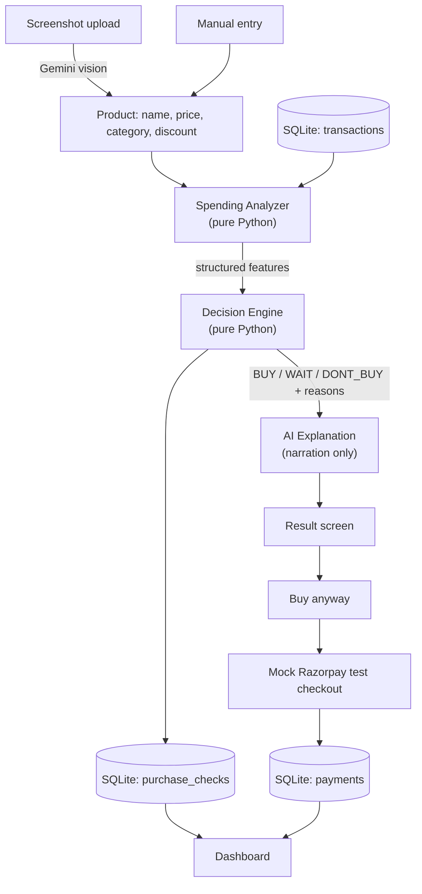

# Should I Buy This?

A Gen-Z personal finance decision assistant that acts like a brutally honest but
supportive friend, right before you spend money.

You paste in (or screenshot) the thing you're about to buy. It checks that purchase
against your actual spending behaviour and gives you one of three answers, with the
reasoning shown:

| Verdict | Meaning |
|---|---|
| BUY | Looks reasonable against your current spending. |
| WAIT | Not a bad purchase, but waiting is probably the better call. |
| DON'T BUY | This conflicts strongly with how you're currently spending. |

It never says "you're irresponsible." It says "this would eat 56% of your remaining
fun budget," and then it tells you which number it used.

---

## The problem

Budgeting apps are retrospective. They tell you what you did wrong last month, at a
point where nothing can be changed about it. The decision that actually matters
happens seconds before checkout, and nothing is there at that moment.

This sits at that moment instead.

---

## The core design principle

**An LLM never decides whether you can afford something.**

The verdict is produced by ordinary Python arithmetic over your transaction history.
The AI is used only where language and vision genuinely help: reading a screenshot,
guessing a category from a product name, and phrasing the result like a friend rather
than a bank.

Every number the AI says out loud is a number the app computed and handed to it. It is
explicitly instructed never to invent a figure, and it cannot change a verdict — by the
time it is called, the verdict already exists.

Concretely, that split is:

- **Data** — what was actually spent (SQLite)
- **Analysis** — what patterns exist in that spending (`spending_analyzer.py`)
- **Decision** — what the app recommends (`decision_engine.py`)
- **AI** — how that recommendation is explained (`ai_explanation.py`)

The app is fully usable with no API key at all. Without one, screenshot reading is
unavailable and the commentary falls back to hand-written lines, but the analysis,
the verdict and the reasons are unchanged — because none of them were ever the AI's
job.

---

## Architecture



Note where the AI is: on the two edges, never on the path from data to verdict.

---

## How the decision is actually made

The Spending Analyzer computes a set of features for the candidate purchase:

- Spend so far this month, overall and in this category
- The category's normal monthly spend, averaged over prior full months
- How far this month deviates from that normal
- Similar purchases in the last 14 days, compared against the pace set *before* that window
- How often this category is normally bought
- This purchase's size versus the category's typical purchase
- Discretionary ("fun") budget remaining

The Decision Engine turns those into concern points. Each check either fires or
doesn't, and when it fires it produces the exact sentence shown to the user:

| Check | Fires when | Points |
|---|---|---|
| Budget | discretionary budget already gone | 3 |
| Budget | purchase costs more than everything left / >= 75% of it | 3 |
| Budget | purchase is >= 50% / >= 25% of what's left | 2 / 1 |
| Category deviation | this month is >= 75% / >= 30% above normal | 2 / 1 |
| Recent purchases | recent pace well above / somewhat above the prior baseline | 2 / 1 |
| Purchase size | >= 3x / >= 1.75x the category's typical purchase | 2 / 1 |

Total score of 0-1 is BUY, 2-4 is WAIT, 5 or more is DON'T BUY.

The budget check is skipped entirely for essential categories (groceries,
transportation). The fun-money budget is the wrong yardstick for a grocery run —
without that exemption the app told you not to buy groceries because you'd
overspent on clothes. Essentials still face every other check, so an unusually
large grocery run is still flagged, just not as a budgeting failure.

Three details worth pointing at, because they were bugs first:

- Historical baselines are computed strictly from transactions **on or before** the
  date being checked. Otherwise a purchase check "today" can be informed by
  transactions that haven't happened yet.
- The recent-purchase check compares a 14-day window against the pace from *before*
  that window. Comparing it to an average that includes the window makes a spending
  burst look normal by definition — it inflates the very baseline it's measured
  against.
- The budget bands go up to 3 points. Capped at 2, a purchase costing 300% of your
  remaining budget scored the same as one costing 50%, and nothing short of an
  already-blown budget could ever reach DON'T BUY.

---

## Project structure

```
app/
  main.py                   Streamlit entry point, routing, input form
  spending_analyzer.py      Feature calculations (no verdicts)
  decision_engine.py        BUY / WAIT / DONT_BUY scoring (no AI)
  ai_explanation.py         Gen-Z narration of an already-made decision
  product_understanding.py  Screenshot reading + category guessing (Gemini)
  ai_client.py              Shared Gemini client and model config
  database.py               SQLite schema, seeding, reads and writes
  data_loader.py            Transaction loading + basic aggregates
  payments.py               Mock Razorpay test checkout
  dashboard.py              Spending and verdict history dashboard
  styles.py                 All custom CSS
  .streamlit/config.toml    Dark theme
data/
  config.py                 Demo user profile, categories, budgets
  generate_data.py          Synthetic transaction generator
  transactions.csv          Generated seed data (599 rows)
```

---

## Setup

Requires Python 3.10 or newer.

```bash
git clone <this repo>
cd buildathon
pip install -r requirements.txt
```

Generate the demo transaction history (already committed, but regenerate any time):

```bash
python3 data/generate_data.py
```

Run the app:

```bash
cd app
streamlit run main.py
```

It opens at `http://localhost:8501`.

**Run it from inside `app/`.** Streamlit resolves `.streamlit/config.toml` against the
working directory, so launching from elsewhere silently loses the dark theme.

### Environment variables

Optional. The app runs fully without them; only screenshot reading and the AI-written
commentary need a key.

```bash
cp .env.example .env
```

Then edit `.env`:

```
GEMINI_API_KEY=AIzaSy_your-key-here
```

Get a free key at <https://aistudio.google.com/apikey> — Google AI Studio has a free
tier and does not require a card.

| Variable | Required | Purpose |
|---|---|---|
| `GEMINI_API_KEY` | No | Screenshot reading, category guessing, AI commentary |
| `GEMINI_MODEL` | No | Override the model (default `gemini-2.5-flash`) |

`.env` is gitignored. If a call fails, the app shows the actual error rather than a
generic message, so a bad key or a retired model name is immediately obvious.

---

## Test cases

Verified against the committed dataset. Run from `app/`:

```bash
python3 -c "
import sys; sys.path.insert(0, '../data')
from config import *
from data_loader import load_transactions
from spending_analyzer import analyze_purchase
from decision_engine import decide
df = load_transactions()
a = analyze_purchase(df, 'electronics', 29999, MONTHLY_BUDGET, DISCRETIONARY_BUDGET,
                     ESSENTIAL_CATEGORIES, RECENT_WINDOW_DAYS, product_name='Headphones')
d = decide(a); print(d['verdict'], d['score'], d['reasons'])
"
```

Cases 1-4 are typed straight into the app, no date juggling needed.

| # | Case | Input | Expected |
|---|---|---|---|
| 1 | Comfortably affordable | Zomato order, Rs 250, food delivery | BUY, score 1 |
| 2 | Large for its category | Black blazer, Rs 3,499, clothing | WAIT, score 2, "6.0x what you'd normally spend on clothing" |
| 3 | Wipes out the month | Sony headphones, Rs 29,999, electronics | DON'T BUY, score 5, "swallow 88% of your remaining fun budget" |
| 4 | Essentials aren't punished | Groceries, Rs 900, groceries | WAIT on size only — never blamed on the fun budget |
| 5 | Screenshot, no API key | Upload any image, click Analyze | Warns that no key is set, manual entry still works |
| 6 | Screenshot, bad key | Set an invalid `GEMINI_API_KEY`, click Analyze | Shows the real API error, manual entry still works |
| 7 | Declined test payment | Buy anyway, pick the failure card | Decline message, retry offered, `failed` row recorded |
| 8 | Successful test payment | Buy anyway, pick the success card | Captured message, `captured` row recorded |
| 9 | Persistence | Judge something, stop the app, restart | Verdict count on the home screen is unchanged |

---

## The demo dataset

`data/generate_data.py` builds a fictional 90-day history for one synthetic user. No
real financial data is used anywhere in this project.

Currently committed: **599 transactions, 2026-06-03 to 2026-09-01, Rs 144,324 total.**

It deliberately contains the patterns the analyzer needs to have something to find:

- Small frequent purchases (food delivery is the highest-count category)
- Recurring subscriptions on fixed days each month
- Weekend-weighted spending and late-night food orders
- Category bursts — short windows with several similar purchases
- Rare big-ticket items (a phone, a trip) as genuine outliers

Full months land at Rs 39.6k-55.3k against a Rs 45,000 budget, so the demo user
sometimes overspends and sometimes doesn't, rather than being uniformly broke.

**The app treats the newest transaction as "today."** The committed dataset ends
early in a month, which is deliberate: it means the fun budget is mostly intact, so
small purchases genuinely return BUY and only expensive ones get pushed to DON'T BUY.
An earlier dataset ended on the last day of an overspent month, which made *every*
purchase — including a Rs 150 snack — score at least a WAIT.

---

## What is real and what is simulated

Worth being precise about, since this touches money:

| Part | Status |
|---|---|
| Transaction history | Synthetic, generated. Not anyone's real data. |
| Budgets and user profile | Fictional, in `data/config.py` |
| All calculations and verdicts | Real arithmetic over that synthetic data |
| AI commentary and screenshot reading | Real Gemini API calls, when a key is set |
| Payments | **Simulated.** No contact with Razorpay, no real money, and no field a real card number could be typed into — you pick from Razorpay's published dummy test cards. |

A simulated payment is never presented as a real one anywhere in the UI.

---

## Limitations

Being honest about what this is:

- **One hardcoded user.** No accounts, no auth, no encryption. It's a local demo.
- **Synthetic data.** There's no bank connection; the history is generated.
- **Thresholds are hand-tuned, not learned.** The point values were chosen for
  interpretability, not fitted to outcomes. They're defensible, not optimal.
- **Sparse history makes category baselines noisy.** With only 90 days, a category
  bought a few times a month has a shaky "normal," and two bursts in the same window
  can partly cancel each other out.
- **The month-end effect is blunt.** Once the discretionary budget is gone, every
  non-essential purchase picks up 3 points, so late in an overspent month even a
  Rs 150 snack reads as WAIT. That is arguably correct — you are out of fun money —
  but it flattens the distinction between a snack and a handbag.
- **Nothing carries over between months.** The budget resets on the 1st, so a
  purchase that's reckless on the 30th is fine on the 1st. Real affordability
  doesn't work in calendar-month steps.
- **Payments are mock.** The flow is demonstrated, not integrated.

---

## Future improvements

- Import real transactions (bank statement or UPI export) instead of synthetic data
- Ask "did you regret it?" a week later, and tune the thresholds from actual answers
- Multi-user accounts with proper auth
- Real Razorpay test-mode integration in place of the mock
- An actual notification when the 72-hour wait is up, since that's the intervention
  most likely to change behaviour
- Smarter burst detection that separates a genuine spree from normal cadence
